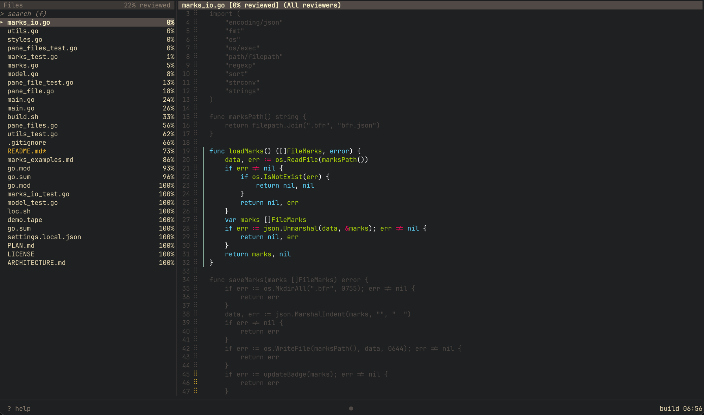

<p align="center">
  
</p>

# Big Friendly Review (Alpha)


A TUI where humans review code. You can also comment on code and hand it off to AI.

<p align="center">
  
</p>

## Install

```sh
git clone https://github.com/arturcarvalho/big-friendly-review.git
cd big-friendly-review
go build -o bfr .
mv bfr /usr/local/bin/ # or wherever you put your binaries

# then run bfr from any folder with a git repository
```

## Why

Reviewing code was not great and got worse with AI (so much code!). 

Tools like Github make it hard to navigate a codebase, and local tools like VS Code or Neovim are more focused on the editing experience. 

I believe getting familiar with a codebase will become more important than editing code. So I thought:

> What if there was a tool focused on reviewing a codebase and interact with AI agents from the confort of your terminal?

## How it works

- Start `bfr` on a folder with a git repository
- You will see a block of code selected, press `up` or `down` arrows to move the selection
- Press `space` it will mark the selected code as `reviewed`
- Press `shift + up / down arrows` or `left / right arrows` to change the size of the selection
- If a piece of code was reviewed and you later changed it with a new commit, it will stop being `reviewed` and be marked as `changed`
- Add a `.bfrignore` file (gitignore syntax) to exclude files from review.

On first launch, a hidden folder `.bfr` is created to store the code review information.

## Features

- **Selection based review** - Slide a selection across code and mark it as reviewed
- **Keyboard focused** - Dozens of iterations were done to try and create nice shortcuts for everything
- **Syntax highlight** - The selection has code highlights. Unreviewed code is dimmed while reviewed code is lighter
- **Based on git** - It uses git commits to find out what changed and make sure both old and new code was reviewed
- **Comments** - Add comments to hand off to AI or a colleague
- **`.bfrignore`** — skip files you don't need to review (gitignore syntax)
- **Badge** - Add a badge to your public repository to see the % of code reviewed by humans


## Keybindings

Press `?` from the app to see the shortcuts.

| Key           | Action                                                     |
| ------------- | ---------------------------------------------------------- |
| `f`           | Search / focus files pane                                  |
| `↑` / `↓`     | Navigate files (when focused on files pane)                |
| `esc`         | Back to code pane                                          |
| `j` / `↓`     | Move selection down                                        |
| `k` / `↑`     | Move selection up                                          |
| `S-j` / `S-↓` | Grow selection                                             |
| `S-k` / `S-↑` | Shrink selection                                           |
| `h` / `←`     | Larger selection preset                                    |
| `l` / `→`     | Smaller selection preset                                   |
| `n`           | Next target                                                |
| `N`           | Prev target                                                |
| `t`           | Cycle target: `●` unreviewed · `▲` changed · `★` important |
| `space`       | Toggle selection reviewed                                  |
| `r`           | Cycle reviewers                                            |
| `i`           | Cycle selection importance                                 |
| `e`           | Open current file in `$EDITOR`                             |
| `Cmd+b`       | Toggle files pane                                          |
| `?`           | Toggle help modal                                          |
| `q`           | Quit                                                       |

> **Note:** When using `e`, bfr pauses until you save and close the file in your editor.

### Importance levels

Pressing `i` cycles through three importance levels for the current selection:

| Indicator | Level  | Meaning                                            |
| --------- | ------ | -------------------------------------------------- |
| `⠿`       | Medium | Default — normal review priority                   |
| `█`       | High   | Important code worth extra attention               |
| `⠸`       | Ignore | Low-value code (boilerplate, generated (😆), etc.) |

## Badge

bfr generates a `.bfr/badge.json` file compatible with [shields.io](https://shields.io). _It only works with public repos_. To add a review badge to your README, commit `.bfr/badge.json` and add:

```md

```

Replace `YOUR_USER` and `YOUR_REPO` with your GitHub username and repository name. The badge updates each time you commit `badge.json` after a review session.

## Warning

- This is very experimental, and although I reviewed a few thousands of lines of code I probably generated more than 10K. The likelihood of slop is high
- I'm still fiddling with shortcuts and how to navigate, it might change a lot
- Only tested on a Mac
